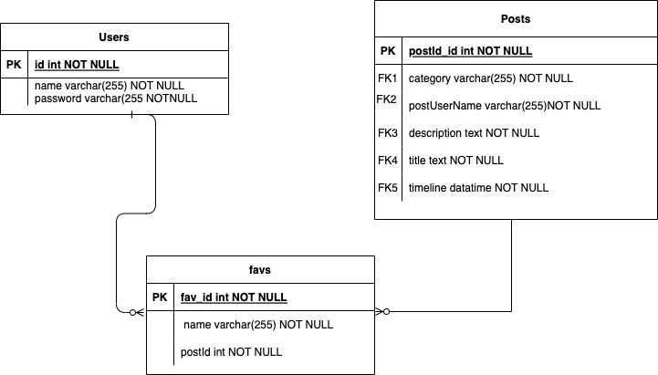
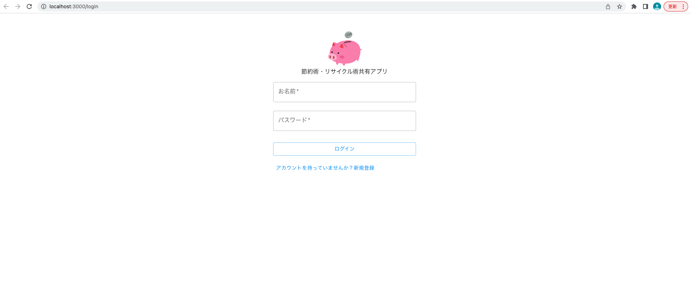
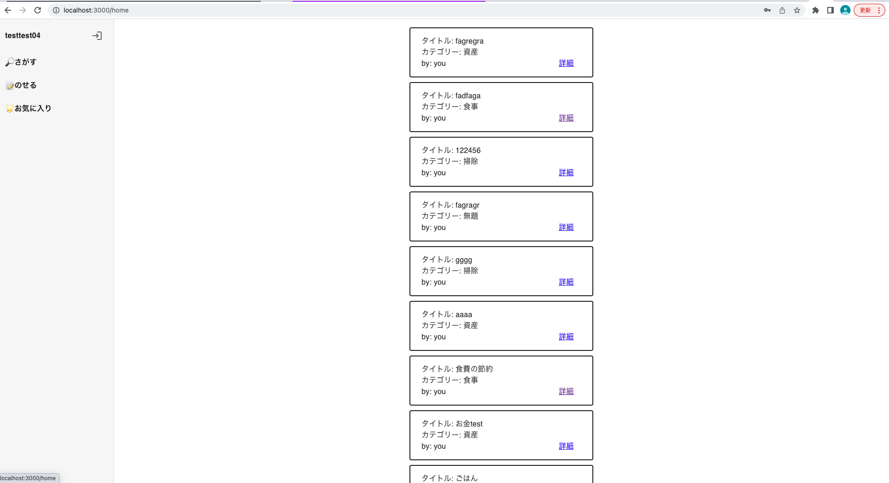
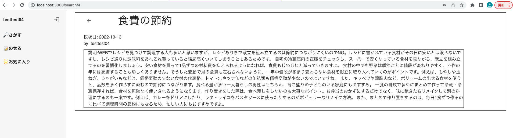
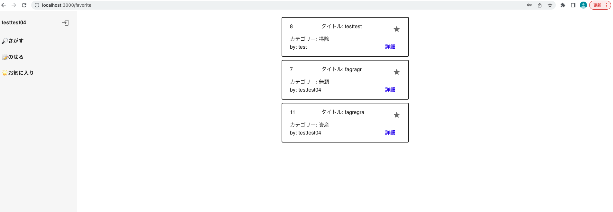

# アプリケーション名

節約術・リサイクル術共有アプリ「ShareEco」

# アプリケーション概要

### URL

デプロイはしていないです。(予定はあり)

### テスト用アカウント

username: testtest04
password: 12345678

### 利用方法

ユーザーを登録する場合はユーザーネーム(４文字以上)とパスワード(8 文字以上)を入力して登録
「のせる!」にて、ご自身の勿体無いから解決した節約術などの概要を書き,それが「食事」「資産運用」などのどの分類かを選ぶ、タイトルを記入して投稿してみてください
「みる！」にて他者のユーザーが投稿した記事のタイトルなどを閲覧する事ができます。星マークをクリックするとお気に入り登録が可能です。また詳細ボタンにて投稿の詳細（手順など）を閲覧する事ができます
「お気に入り」にてお気に入りした投稿を見る事ができます

### 作ろうとした経緯

みんなに使われるものを作りたいなーと思い,人の生活に関わるものや人生のイベントは必然的に人が多くなる予想(結婚:ゼクシィ,衣食住の食:クックパッドなど)
今回は買い物方法など分からない,新卒 1 年目や 1 人暮らし始まりの大学生,夫婦などがターゲット,特に新卒 1 年目は,絶えることないなと思い,類似サービスを検索したが資産運用などが多く作ろうとしているサービスはないなと思い作成を決めました.

### 実装した機能

ログイン機能
JWT 認証やバリデーションチェック
登録機能
投稿機能
検索機能
お気に入り機能

### 今後したいこと

実装機能をもっと豊富にすること
Docker のコンテナ内で動くようにすること
nginx のコンテナと接続してデプロイを用意する

### 使用技術

React(17.0.2)
NodeJS(v16.14.2)
npm(8.5.0)
Mysql(8.0.30)

### ER 図

### テスト

バックエンド(nodejs)でポストマンを使用

### スクショ

#### ログイン

#### 自分の投稿閲覧

#### 投稿の詳細表示

#### お気に入りした投稿

